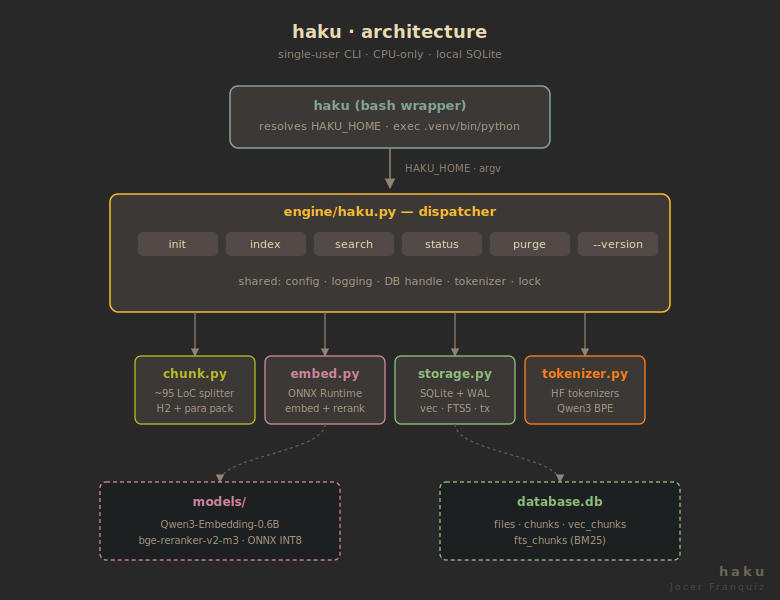
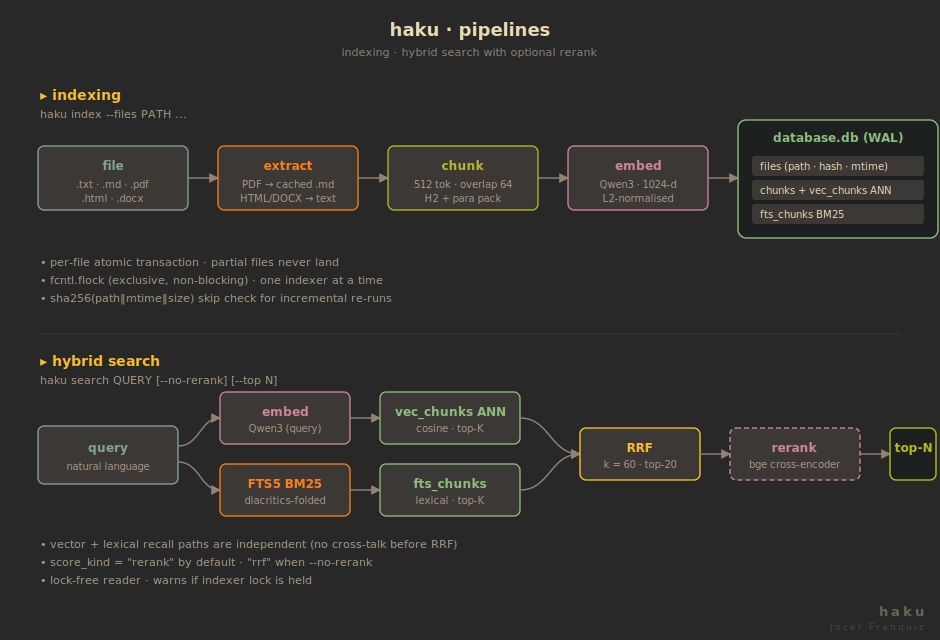

# haku

> *Haku* = "search" in Finnish.

A 100% local, CPU-only, multilingual semantic + lexical hybrid search CLI.
Index `.txt`, `.md`, `.pdf`, `.html`, and `.docx` files, then query them with
natural language — no API keys, no cloud, no GPU.

Built for personal document collections: research papers, notes, books,
technical docs. English and Spanish out of the box.

## Why haku

| Concern | Approach |
|---------|----------|
| **Privacy** | Everything runs locally. No data leaves your machine. |
| **No GPU** | INT8-quantized ONNX models run on CPU. ~1.3 GB peak RAM. |
| **Hybrid retrieval** | Dense vectors (Qwen3-Embedding-0.6B) + BM25 (FTS5), fused with Reciprocal Rank Fusion (k=60), optionally reranked by a cross-encoder (bge-reranker-v2-m3). |
| **Crash-safe** | WAL-mode SQLite with per-file transactions. Kill mid-index, resume with zero rework. |
| **Incremental** | `sha256(path\|\|mtime\|\|size)` skip check. Re-indexing a 5k-file corpus after one edit takes seconds. |
| **Bilingual** | FTS5 with `unicode61 remove_diacritics 2` — `café` matches `cafe`, `niño` matches `nino`. |
| **Single binary feel** | One `haku` bash entrypoint, transparent venv activation, no daemon. |

## Architecture



### Pipelines



- Chunker: custom ~95-line H2-boundary + paragraph-packing splitter with token-budget overlap
- Embedder: Qwen3-Embedding-0.6B (INT8, ONNX Runtime, last-token pooling, 1024-dim)
- PDF conversion parallelized with `ThreadPoolExecutor`
- Per-file atomic transactions — partial files never land in the DB
- Vector side: cosine similarity via sqlite-vec
- Lexical side: FTS5 BM25 with diacritics-aware unicode61 tokenizer
- Reranker: bge-reranker-v2-m3 cross-encoder (on by default, `--no-rerank` to skip)

## Models

| Role | Model | Source | Quantization | Disk | License |
|------|-------|--------|--------------|------|---------|
| Embedder | Qwen3-Embedding-0.6B | `onnx-community/Qwen3-Embedding-0.6B-ONNX` | INT8 | ~586 MB | Apache 2.0 |
| Reranker | bge-reranker-v2-m3 | `onnx-community/bge-reranker-v2-m3-ONNX` | INT8 | ~545 MB | MIT |

Models are **not** bundled or auto-downloaded. Place them manually per
[`MODELS.md`](MODELS.md) — pinned to specific HF commit revisions for
reproducibility. `haku status` verifies integrity via SHA-256.

## Memory budget

| Scenario | Peak RSS |
|----------|----------|
| Indexing (both models loaded) | ~1.3–1.5 GB |
| Search with reranking | ~900 MB |
| Search with `--no-rerank` | ~600 MB |

Comfortable on 8 GB machines. Tight budgets should use `--no-rerank`.

## CLI

```
haku init    [--quiet]
haku index   --files PATH ... [--chunks 512] [--overlap 64] [--embedder NAME]
             [--reindex] [--format json|text] [--output PATH] [--quiet]
haku search  QUERY [--files PATH ...] [--top 5] [--rerank-top 20]
             [--no-rerank] [--rerank-model NAME] [--embedder NAME]
             [--format json|text] [--output PATH] [--quiet]
haku status  [--format json|text] [--output PATH] [--quiet]
haku purge   [--format json|text] [--output PATH] [--quiet]
haku --version [--full]
```

### Config precedence

**CLI flag > environment variable (`HAKU_*`) > `config.json` > built-in defaults**

### Output formats

`--format text` (default) produces human-scannable numbered results:

```
1. [0.87] /home/user/books/cs/turing.pdf
   chunk 17 · chars 4821–5333
   ...the imitation game, which we call the Turing test...
```

`--format json` produces a stable schema for piping:

```bash
haku search "turing test" --format json | jq -r '.results[0].path' | xargs xdg-open
```

## Storage

- **SQLite** with WAL mode — readers never block writers
- **sqlite-vec** for vector ANN search
- **FTS5** (external content, trigger-synced) for BM25 lexical search
- Schema versioned — mismatch refuses to run (no automatic migrations)
- `haku purge` reconciles disk deletions with DB state

## Concurrency

- `haku index` takes an exclusive `fcntl.flock` — one indexer at a time
- `haku search` runs lock-free against the WAL database; warns if indexing is in progress
- `haku purge` takes the indexer lock (mutates `files` + cascades)

## Requirements

- Python 3.12
- ~1.2 GB disk for ONNX models
- Linux (uses `fcntl.flock`; macOS may work but is untested)

## Installation

`haku` is a single-user, per-machine CLI. No daemon, no service, no package
registry — clone, drop the models in place, and `init`.

### 1. Clone

```bash
git clone https://github.com/jocerfranquiz/haku.git /haku
# or anywhere you like:
git clone https://github.com/jocerfranquiz/haku.git ~/code/haku
export HAKU_HOME=~/code/haku    # only needed if not at /haku
```

The bash wrapper resolves `HAKU_HOME` and exports it to Python; everything
under that root is self-contained.

### 2. Place the models

Models are **not** bundled and **not** auto-downloaded. Follow
[`MODELS.md`](MODELS.md) to fetch the two ONNX repos at their pinned commit
revisions and lay them out as:

```
$HAKU_HOME/models/
├── Qwen3-Embedding-0.6B/
│   ├── onnx/model_int8.onnx
│   └── tokenizer.json
└── bge-reranker-v2-m3/
    ├── onnx/model_quantized.onnx
    └── tokenizer.json
```

Hashes are pinned in `engine/manifest.json` and verified at load time.

### 3. Bootstrap

```bash
$HAKU_HOME/haku init
```

The bash wrapper checks for `python3.12`, creates `$HAKU_HOME/.venv`, installs
`engine/requirements.txt` into it, then hands off to Python to create the
SQLite database, FTS5 indexes, and runtime directories. Idempotent — safe to
re-run.

### 4. (Optional) Put `haku` on your `PATH`

```bash
ln -s $HAKU_HOME/haku ~/.local/bin/haku
```

### 5. Smoke test

```bash
haku --version --full        # prints model revisions + SHA-256s
haku status                  # verifies model integrity + DB stats
haku index --files ~/notes
haku search "your query"
```

### Uninstall

```bash
rm -rf $HAKU_HOME            # repo, venv, DB, models, logs — all under one root
```

### Multi-machine

Each machine gets its own clone, its own `.venv`, its own model copies, and
its own DB. There is no shared-index or remote-query mode — by design (§1).
To migrate an existing index, copy `database.db*` and `markdowns/` to the new
machine's `$HAKU_HOME`; schema version must match (§19).

## Licensing

`haku` is **GPL v3**. `PyMuPDF4LLM` is **AGPL v3** — the AGPL network clause
propagates to the combined work (irrelevant for a local CLI). Model weights
are Apache 2.0 (Qwen3) and MIT (BGE). Full inventory: [`LICENSES.md`](LICENSES.md).

## Design

The full specification lives in [`DESIGN.md`](DESIGN.md) — architecture,
schema DDL, indexing pipeline, search pipeline, concurrency contract, error
handling, and build order.
